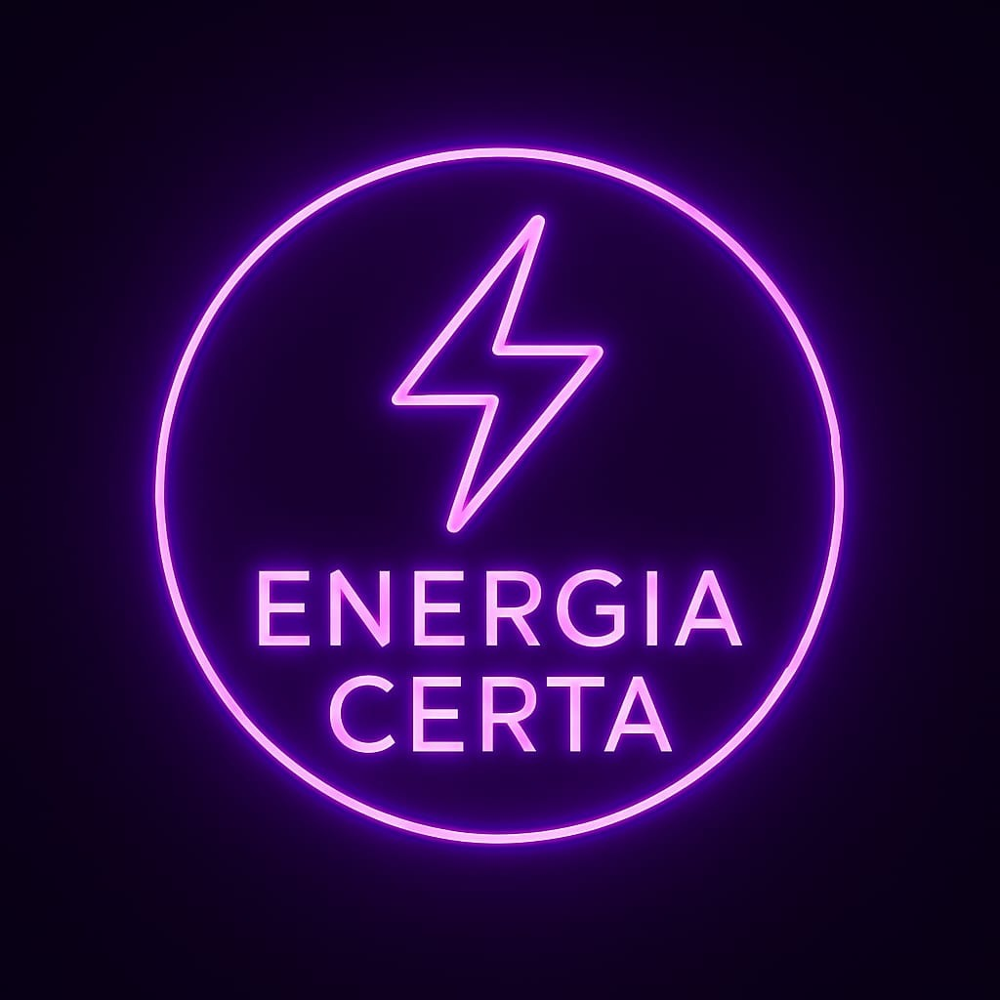

# EnergiaCerta - Análise de Fatura de Energia

Aplicação para análise e comparação de tarifas de energia em Portugal.

Ver app online: [https://energiacerta.vercel.app](https://energiacerta.vercel.app)

## Run Locally

**Prerequisites:**  Node.js

1. Install dependencies:
   `npm install`
2. Set the `GEMINI_API_KEY` in [.env.local](.env.local) to your Gemini API key
3. Run the app:
   `npm run dev`

## Data Updates

Currently, the tariff data in the database is **manually updated**. There is no automated background process scraping the provider websites.
However, the application always fetches the **latest data available in the database** at the moment of analysis.

To update prices, an administrator must run SQL updates on the database.
